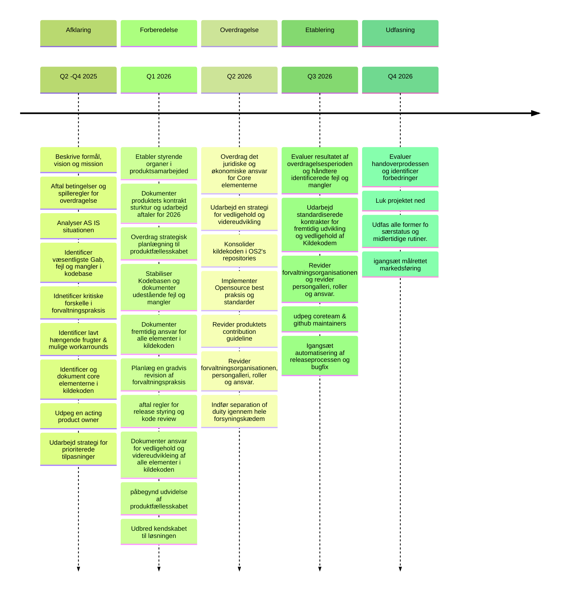

#### Overordnet plan for overdragelsen af os2 display:

```mermaid
%% Help: Milestones are displayed using Mermaid timeline syntax. Please include a section for each milestone and identify all tasks releated to reaching the goal.
%% Mermaid documentation for timeline syntax: https://mermaid.js.org/syntax/timeline.html
%%{init: { 'theme': 'forest', 'timeline': {'disableMulticolor': true}}}%%
timeline
    section Afklaring
      Q2 -Q4 2025 : Beskrive formål, vision og mission
                   : Aftal betingelser og spilleregler for overdragelse
                   : Analyser AS IS situationen
                   : Identificer væsentligste Gab, fejl og mangler i kodebase
                   : Idnetificer kritiske forskelle i forvaltningspraksis
                   : Identificer lavt hængende frugter & mulige workarrounds
                   : Identificer og dokument core elementerne i kildekoden
                   : Udpeg en acting product owner 
                   : Udarbejd strategi for prioriterede tilpasninger
      
    section Forberedelse
      Q1 2026      : Etabler styrende organer i produktsamarbejded
                   : Dokumenter produktets kontrakt sturktur og udarbejd aftaler for 2026
                   : Overdrag strategisk planlægning til produktfællesskabet
                   : Stabiliser Kodebasen og dokumenter udestående fejl og mangler
                   : Dokumenter fremtidig ansvar for alle elementer i kildekoden
                   : Planlæg en gradvis revision af forvaltningspraksis 
                   : aftal regler for release styring og kode review
                   : Dokumenter ansvar for vedligehold og videreudvikleing af alle elementer i kildekoden
                   : påbegynd udvidelse af produktfællesskabet
                   : Udbred kendskabet til løsningen

    section Overdragelse
     Q2 2026  : Overdrag det juridiske og økonomiske ansvar for Core elementerne
              : Udarbejd en strategi for vedligehold og videreudvikling
              : Konsolider kildekoden i OS2's repositories
              : Implementer Opensource best praksis og standarder
              : Revider produktets contribution guideline
              : Revider forvaltningsorganisationen, persongalleri, roller og ansvar. 
              : Indfør separation of duity igennem hele forsyningskædem
    section Etablering
     Q3 2026 : Evaluer resultatet af overdragelsesperioden og håndtere identificerede fejl og mangler
              : Udarbejd standardiserede kontrakter for fremtidig udvikling og vedligehold af Kildekodem
              : Revider forvaltningsorganisationen og revider persongalleri, roller og ansvar.
              : udpeg coreteam & github maintainers
              : Igangsæt automatisering af releaseprocessen og bugfix 


    section Udfasning
    Q4 2026 : Evaluer handoverprodessen og identificer forbedringer
              : Luk projektet ned
              : Udfas alle former fo særstatus og midlertidige rutiner. 
              : igangsæt målrettet markedsføring
```
